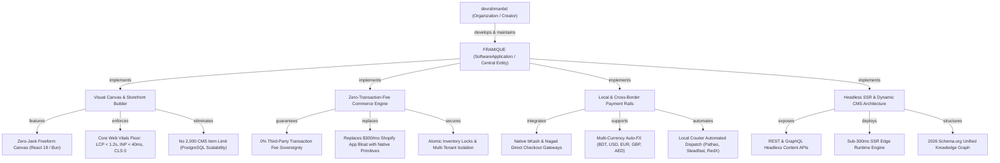

# FRAMIQUE — Semantic SEO Topical Authority & Entity Graph Map

**Document ID:** `FRAMIQUE-SEO-TAM-02`  
**Framework:** Koray Tuğberk Gübür's Holistic Semantic SEO & Information Retrieval Theory  
**Central Entity:** `FRAMIQUE` (Software Application / Cloud CMS & Commerce Platform)  
**Parent Entity / Creator:** `devrahmanbd` (Framique Engineering Council)  
**Source Context:** High-Performance Visual Storefront Builder, Cloud CMS & Zero-Transaction-Fee Commerce Engine  
**Date:** September 2026  

---

## 1. Theoretical Foundations (Koray Tuğberk Gübür Methodology)

In modern Semantic Search (Google Hummingbird, RankBrain, MUM, Gemini Search, and LLM Knowledge Graph embeddings), search engines rank documents based on **Topical Authority**, **Contextual Relevance**, and **Cost of Retrieval**, rather than lexical repetition or simple keyword density.

### Key Axioms Applied to FRAMIQUE:
1. **The Central Entity:** The focal point of the entire topical graph. All sub-entities, predicates, and attributes anchor back to `FRAMIQUE` and its creator `devrahmanbd`.
2. **Source Context:** Defines the operational domain of `FRAMIQUE`. `FRAMIQUE` is not a generic static blog generator or closed template system; it is a **visual design canvas, high-concurrency Cloud CMS, and sovereign commerce engine with native local payment rails**.
3. **Macro Context vs. Micro Context:**
   - *Macro Context:* The site architecture, category taxonomy, and hub-and-spoke URL cluster hierarchy.
   - *Micro Context:* The predicate-argument structures, subject-predicate-object triples, and sentence-level clarity within individual pages.
4. **Information Tree & Information Gain:** Foundational principles (fee sovereignty, visual canvas, SSR performance) are established first before specialized comparisons or programmatic edges. Delivers first-party empirical data that derivative AI cannot generate.
5. **Entity-Attribute-Value (EAV) Modeling:** Factual relationships are structured to enable unambiguous knowledge extraction by search crawlers and AI reasoning models.
6. **Cost of Retrieval Minimization:** Direct-answer sentence structures, clean semantic HTML, unified schema, zero layout shift (CLS 0), and sub-300ms SSR to minimize crawler compute expense and maximize topical confidence.

---

## 2. Central Entity & Knowledge Graph Specification



---

## 3. Entity-Attribute-Value (EAV) Semantic Triples

Semantic search engines extract unstructured prose into structured EAV triples. The following verified triples are systematically embedded into FRAMIQUE's public and technical pages:

| Entity (Subject) | Attribute (Predicate) | Value (Object) | Semantic Context / Disambiguation |
|---|---|---|---|
| `FRAMIQUE` | `isTypeOf` | `SoftwareApplication` | Cloud CMS & Commerce SaaS Platform |
| `FRAMIQUE` | `developer` | `devrahmanbd` | Software engineering organization |
| `FRAMIQUE` | `transactionFeeModel` | `Zero Percent (0.00%)` | Eliminates Shopify 2% third-party penalty |
| `FRAMIQUE` | `designInterface` | `Visual Drag-and-Drop Canvas` | Pixel-level visual styling without code |
| `FRAMIQUE` | `renderingEngine` | `Server-Side Rendering (SSR)` | Bun & React 19 sub-300ms edge delivery |
| `FRAMIQUE` | `databaseArchitecture` | `PostgreSQL / SQLite Multi-Tenant` | High concurrency with zero arbitrary CMS caps |
| `FRAMIQUE` | `localPaymentRails` | `bKash, Nagad, Regional Gateways` | Native automated mobile financial checkout |
| `FRAMIQUE` | `globalPaymentRails` | `Stripe, PayPal, Multi-Currency` | Frictionless cross-border merchant settlement |
| `FRAMIQUE` | `coreWebVitalsStandard` | `LCP < 1.2s, INP < 40ms, CLS 0` | 100% Google CWV green badge pass rate |
| `FRAMIQUE` | `schemaStandard` | `Schema.org 2026 SSR-Only` | SoftwareApplication, Organization, Product |
| `FRAMIQUE` | `competitorAlternatives` | `Shopify, Webflow, Framer, WooCommerce` | Unified visual + commerce alternative |

---

## 4. Macro Context: Topical Hub-and-Spoke Architecture

Topical Authority is built by constructing mutually exclusive, collectively exhaustive (MECE) content clusters around the Central Entity:

```
/ (Root: Flagship Hub — Visual CMS, 0% Fee Commerce & Local Rails)
│
├── /compare/ (Hub: Competitive Contrast & Migration Vectors)
│   ├── /compare/shopify           [Spoke 1.1: 0% Fee Sovereignty vs 2% App Tax]
│   ├── /compare/webflow           [Spoke 1.2: Dynamic Commerce vs 2k Item Caps & Sluggish JS]
│   ├── /compare/framer            [Spoke 1.3: Real Inventory & Payment Rails vs Static Mockups]
│   └── /compare/woocommerce       [Spoke 1.4: Cloud Managed Speed vs Broken WordPress Plugins]
│
├── /features/ (Hub: Core Architectural Primitives)
│   ├── /features/visual-builder   [Spoke 2.1: Freeform Visual Canvas & Responsive Breakpoints]
│   ├── /features/commerce-engine  [Spoke 2.2: Native Cart, Checkout & Inventory Automation]
│   ├── /features/local-payments   [Spoke 2.3: bKash, Nagad & Regional Banking Gateways]
│   └── /features/performance      [Spoke 2.4: Sub-300ms SSR & Core Web Vitals Compliance]
│
├── /solutions/ (Hub: Vertical & Regional Merchant Solutions)
│   ├── /solutions/dtc-brands      [Spoke 3.1: High-Growth Direct-to-Consumer Brands]
│   ├── /solutions/design-studios  [Spoke 3.2: Creative Agencies & White-Label Builders]
│   ├── /solutions/regional-market [Spoke 3.3: Bangladesh, South Asia & Emerging Market Hubs]
│   └── /solutions/headless        [Spoke 3.4: Headless Storefronts & Multi-Channel APIs]
│
├── /pricing/ (Hub: Economic Transparency & TCO Contrast)
│   └── /pricing/calculator        [Spoke 4.1: Interactive Shopify App Tax vs Framique TCO]
│
└── /blog/ (Hub: Educational Authority & Problem-Aware Content)
    ├── /blog/shopify-fee-exodus                    [Pillar Spoke 5.1]
    ├── /blog/webflow-cms-limits-broken             [Pillar Spoke 5.2]
    ├── /blog/local-payment-gateway-integration     [Pillar Spoke 5.3]
    └── [24 Scheduled Strategic Articles]           [Spokes 5.4 – 5.24]
```

---

## 5. Micro Context: Information Retrieval & Linguistic Grounding

To minimize search engine **Cost of Retrieval**:
1. **Zero Fluff Lead Sentences:** Every page opens with an authoritative definition containing the Central Entity, its category, its primary differentiator, and a verifiable metric.
2. **Definitional Passages (134–167 Words):** Formatted for zero-pronoun algorithmic extraction into Google AI Overviews, Perplexity citations, and Claude Search snippets.
3. **Contextual Internal Linking:** Every spoke links back to its parent hub using descriptive, entity-rich anchors (e.g. `[0% fee Shopify alternative](/compare/shopify)` rather than `[click here]`).
