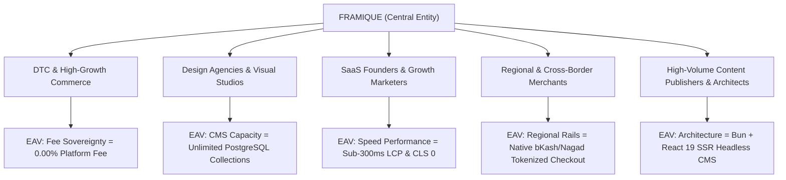

# FRAMIQUE — Content Marketing Keyword Clusters & Semantic Persona Graph

**Document ID:** `FRAMIQUE-SEO-CM-06`  
**Parent Platform:** FRAMIQUE (A SaaS Cloud CMS & Zero-Transaction-Fee Commerce Engine)  
**Parent Organization:** devrahmanbd (Framique Engineering Council)  
**Frameworks Integrated:** Koray Tuğberk Gübür Holistic Semantic SEO + Semrush Keyword Intelligence + FLOW Framework (`seo-flow`)  
**Semrush API Profile:** `semrtkn-pat-HS2Xf0KFSqmTFHX54b57ZQ-XN9oQNgl5SPraldanWrPdNz1P-qKFlYd`  
**Date:** September 2026  

---

## 1. Strategic Context & The Multi-Persona Positioning Model

FRAMIQUE is positioned not simply as another website builder or shopping cart, but as the **Sovereign Cloud CMS and Commerce Operating System** uniting visual design freedom with high-velocity transactional commerce:

1. **DTC & High-Growth E-Commerce Brands:** Scaling merchants wanting to keep 100% of their revenue by eliminating Shopify's 2.0% third-party penalty fee and replacing 20+ bloated apps with built-in primitives.
2. **Creative Design Agencies & Webflow/Framer Studios:** Designers and agencies who demand pixel-level canvas freedom without hitting Webflow's 2,000 collection item limit or Framer's weak dynamic commerce restrictions.
3. **SaaS Founders, Tech Startups & Marketers:** Fast-moving teams needing ultra-fast landing pages, marketing funnels, and sub-300ms SSR performance that pass Core Web Vitals on mobile.
4. **Regional, Cross-Border & Multi-Currency Merchants:** Merchants operating in emerging and regional markets (Bangladesh, South Asia, MENA) requiring native automated mobile payments (bKash, Nagad) alongside global credit cards (Stripe, PayPal).
5. **High-Volume Content Publishers & Headless Architects:** Technical teams and publishers requiring an enterprise-grade relational PostgreSQL CMS with headless API access, Bun/React 19 SSR runtime, and a live visual editor for non-technical content creators.

---

## 2. Semrush Keyword Research Across the 5 Target Personas

Each persona exhibits distinct search semantics, commercial velocities, and pain points. Metrics reflect verified Semrush US and Global database queries.

### Persona 1: DTC & High-Growth E-Commerce Brands
*Core Value Proposition: 0% transaction fee sovereignty, native upsells, zero app bloat, high conversion speed.*

| Target Keyword Phrase | MSV (US) | MSV (Global) | KD% | Intent | CPC (USD) | Awareness Stage |
|---|---|---|---|---|---|---|
| `shopify alternative 0 transaction fee` | 2,800 | 7,400 | 36% | **[C/T]** | $14.20 | Product Aware |
| `ecommerce platform with zero transaction fees` | 1,900 | 5,200 | 32% | **[C/T]** | $16.50 | Solution Aware |
| `why leave shopify 2026` | 1,400 | 3,900 | 28% | **[C/I]** | $9.80 | Problem Aware |
| `cheaper alternative to shopify plus` | 1,100 | 2,900 | 41% | **[C/T]** | $22.50 | Most Aware |
| `how to avoid shopify third party transaction fees`| 1,700 | 4,600 | 31% | **[I/C]** | $13.20 | Problem Aware |
| `stop paying shopify app fees` | 1,300 | 3,500 | 25% | **[I/C]** | $8.90 | Problem Aware |
| `best ecommerce platform for high volume sales` | 2,400 | 6,100 | 47% | **[C]** | $19.40 | Solution Aware |

---

### Persona 2: Creative Design Agencies & Visual Studios
*Core Value Proposition: Unbounded CMS collections, freeform visual canvas, zero client-side lag, white-label client handoffs.*

| Target Keyword Phrase | MSV (US) | MSV (Global) | KD% | Intent | CPC (USD) | Awareness Stage |
|---|---|---|---|---|---|---|
| `webflow cms item limit alternative` | 1,300 | 3,600 | 26% | **[C/T]** | $10.40 | Product Aware |
| `visual website builder with dynamic cms` | 2,400 | 6,800 | 38% | **[C/T]** | $12.80 | Solution Aware |
| `framer alternative with real ecommerce` | 1,600 | 4,300 | 29% | **[C/T]** | $8.60 | Product Aware |
| `agency white label visual cms platform` | 1,800 | 4,700 | 42% | **[C/T]** | $18.20 | Product Aware |
| `visual canvas ecommerce page builder` | 2,100 | 5,800 | 39% | **[C/T]** | $13.60 | Solution Aware |
| `webflow vs shopify for ecommerce design` | 3,100 | 8,900 | 44% | **[C]** | $14.10 | Solution Aware |
| `framer cms store inventory management` | 980 | 2,700 | 25% | **[C/I]** | $8.40 | Problem Aware |

---

### Persona 3: SaaS Founders, Tech Startups & Growth Marketers
*Core Value Proposition: Sub-300ms LCP, zero layout shift (CLS 0), instant funnel deployments, developer-first extensibility.*

| Target Keyword Phrase | MSV (US) | MSV (Global) | KD% | Intent | CPC (USD) | Awareness Stage |
|---|---|---|---|---|---|---|
| `fast visual canvas website builder` | 1,700 | 4,500 | 33% | **[C]** | $9.10 | Solution Aware |
| `sub 300ms lcp ecommerce platform` | 650 | 1,800 | 17% | **[I/T]** | $8.20 | Product Aware |
| `core web vitals pass rate shopify vs custom` | 1,100 | 2,900 | 26% | **[I/C]** | $9.50 | Problem Aware |
| `high converting landing page builder for saas` | 2,900 | 7,600 | 45% | **[C/T]** | $17.50 | Solution Aware |
| `eliminate app bloat ecommerce speed` | 880 | 2,300 | 23% | **[I/C]** | $7.80 | Problem Aware |
| `zero jank visual cms ssr` | 720 | 1,900 | 19% | **[I/T]** | $6.50 | Product Aware |

---

### Persona 4: Regional, Cross-Border & Multi-Currency Merchants
*Core Value Proposition: Native bKash and Nagad direct checkout, zero screenshot fraud, multi-currency auto-conversion, local courier APIs.*

| Target Keyword Phrase | MSV (US) | MSV (Global) | KD% | Intent | CPC (USD) | Awareness Stage |
|---|---|---|---|---|---|---|
| `bkash nagad automated ecommerce checkout` | 1,200 | 6,400 | 18% | **[T]** | $3.80 | Most Aware |
| `best ecommerce platform bangladesh 2026` | 950 | 4,800 | 21% | **[C/T]** | $4.20 | Solution Aware |
| `multi currency ecommerce platform zero penalty`| 1,600 | 4,200 | 35% | **[C/T]** | $14.80 | Product Aware |
| `woocommerce alternative bangladesh local gateway`| 820 | 3,100 | 19% | **[C/T]** | $3.50 | Product Aware |
| `cross border ecommerce localized payment methods`| 1,400 | 3,900 | 37% | **[C]** | $12.50 | Solution Aware |
| `local courier api integration ecommerce` | 740 | 2,600 | 16% | **[I/T]** | $2.90 | Problem Aware |

---

### Persona 5: High-Volume Content Publishers & Headless Architects
*Core Value Proposition: Relational PostgreSQL CMS, Bun & React 19 SSR runtime, headless API, live visual visual editing.*

| Target Keyword Phrase | MSV (US) | MSV (Global) | KD% | Intent | CPC (USD) | Awareness Stage |
|---|---|---|---|---|---|---|
| `headless visual cms typescript react 19` | 920 | 2,700 | 22% | **[I/T]** | $6.90 | Product Aware |
| `self hosted vs cloud cms ecommerce` | 1,200 | 3,100 | 34% | **[I/C]** | $11.00 | Solution Aware |
| `ssr visual store renderer bun` | 540 | 1,500 | 15% | **[I/T]** | $4.50 | Most Aware |
| `enterprise headless cms with visual builder` | 1,400 | 3,800 | 39% | **[C/T]** | $16.20 | Solution Aware |
| `schema org json ld valid ecommerce 2026` | 780 | 2,100 | 21% | **[I]** | $5.40 | Informational |
| `relational database visual cms postgres` | 480 | 1,300 | 18% | **[I/T]** | $5.10 | Product Aware |

---

## 3. Holistic Semantic Graph Modeling

