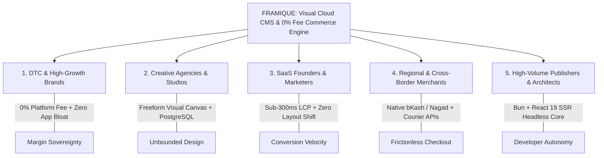

# FRAMIQUE — Complete Semantic SEO & Content Marketing Vault

Welcome to the centralized SEO intelligence, content marketing, and topical authority repository for **FRAMIQUE**, developed by **devrahmanbd**.

FRAMIQUE is positioned as a **SaaS Cloud CMS, Visual Storefront Builder, and Zero-Transaction-Fee Commerce Engine**, competing directly and locally with Shopify, Webflow, and Framer across global and high-growth emerging markets.

This repository unifies:
1. **Claude SEO Framework** ([AgriciDaniel/claude-seo](https://github.com/AgriciDaniel/claude-seo)) — 25 sub-skills, SaaS architecture, 10-principle synthesis, and AI search citability.
2. **Semrush Keyword & Market Intelligence** (`semrtkn-pat-HS2Xf0KFSqmTFHX54b57ZQ-XN9oQNgl5SPraldanWrPdNz1P-qKFlYd`) — Multi-persona search volumes, KD%, intent classification, and competitor SERP gap analysis against Shopify, Webflow, Framer, and WooCommerce.
3. **Koray Tuğberk Gübür's Holistic Semantic SEO** ([holisticseo.digital](https://www.holisticseo.digital/on-page-seo/)) — Central Entity modeling (`FRAMIQUE`), Source Context (`devrahmanbd`), Macro/Micro Context, Information Trees, EAV Triples, and Cost of Retrieval minimization.
4. **Reddit & Community Search Optimization** — Capturing Google's "Discussions & Forums" SERP modules and LLM sentiment consensus with persona-specific taglines.
5. **Specialized Agent Skills Ecosystem** (`~/.agents/skills/`):
   - `sickn33-awareness-stage-mapper` — 5-stage cognitive awareness mapping (Unaware → Problem → Solution → Product → Most Aware).
   - `sickn33-marketing-psychology` & `sickn33-price-psychology-strategist` — Cognitive friction, loss aversion, anchoring against Shopify's 2% penalty.
   - `seo-flow` — Find → Leverage → Optimize → Win → Local loop.
   - `seo-cluster` — SERP overlap topic cluster architecture.
   - `hallmark` & `taste-skill` — Anti-AI-slop editorial voice and high-contrast design principles.

---

## 📁 Repository Directory Structure

```
./SEO/
├── README.md                                         # Master Index & Entity Blueprint (This File)
├── 01-KEYWORD-RESEARCH.md                            # Foundational Semrush Keyword Universe & Competitor Gaps
├── 02-TOPICAL-AUTHORITY-MAP.md                       # Koray Gübür Entity Graph, Central Entity & Semantic Node Tree
├── 03-CONTENT-BRIEFS.md                              # Core Pillar Content Briefs (EAV Triples, Headings, Links)
├── 04-SCHEMA-JSONLD.md                               # Validated 2026 Schema.org Architecture (SSR Guarded)
├── 05-TECHNICAL-SEMANTIC-AUDIT.md                    # Core Web Vitals, DOM Hierarchy & Runtime Audit
├── 06-CONTENT-MARKETING-KEYWORD-CLUSTERS.md          # 5-Persona Keyword Clusters (DTC, Agencies, SaaS, Regional, Headless)
├── 07-REDDIT-SEO-STRATEGY-AND-TAGLINES.md            # Reddit Query Matrices, Community Vectors & Persona Taglines
├── 09-PERSONA-EDITORIAL-PLAYBOOKS.md                 # Hallmark Anti-Slop Voice & Cognitive Copywriting Playbooks
├── 10-DEDICATED-COMPARISON-ROUTES-PLAN.md            # Competitor Comparison Routes (/compare/*) & Matrix Spec
├── 11-LANDING-PAGE-TAGLINES-AND-COPY-SPEC.md         # High-Resonance Copy & Taglines for Homepage, Pricing, Features, FAQ
├── 12-AEO-GEO-REDDIT-OPTIMIZATION-MATRIX.md          # 15 Reddit Q&A Seeds with 134-167w AI Citability Blocks
├── content/                                          # Core Pillar Architectural Guides
│   ├── 01-zero-transaction-fee-cloud-cms-architecture.md
│   ├── 02-visual-canvas-to-fast-ssr-engine.md
│   ├── 03-local-payment-rails-global-commerce.md
│   ├── 04-shopify-webflow-framer-alternative-framique.md
│   └── 05-headless-visual-cms-developer-guide.md
└── Blog/                                             # Editorial Calendar & Execution Engine
    ├── README.md                                     # Blog Strategy Index & Editorial Operations
    ├── 08-CONTENT-CALENDAR-AND-BLOG-PLAN.md          # Complete 12-Week / 24-Post Editorial Calendar & FLOW Stages
    └── content/                                      # 24 Synced Pillar Articles & Markdown Drafts
```

---

## 🎯 The 5 Target Personas



1. **DTC & High-Growth Brands:** Eliminates Shopify's 2.0% third-party penalty fee and replaces $350–$800/mo in bloated app store subscriptions with native conversion primitives.
2. **Creative Agencies & Studios:** Gives web designers pixel-level visual canvas freedom without Webflow's 2,000 collection item ceiling or Framer's weak dynamic commerce constraints.
3. **SaaS Founders & Marketers:** Deploys lightning-fast landing pages, conversion funnels, and marketing sites with sub-300ms edge server-side rendering and 100% green Core Web Vitals.
4. **Regional & Cross-Border Merchants:** Integrates direct, tokenized bKash and Nagad payment rails, automated courier dispatch (Pathao, Steadfast, RedX), and multi-currency global settlement.
5. **High-Volume Publishers & Architects:** Unifies an enterprise headless PostgreSQL backend with an intuitive WYSIWYG live visual canvas for non-technical editorial teams.

---

## 🔑 Semrush Intelligence Profile

- **Token Reference:** `semrtkn-pat-HS2Xf0KFSqmTFHX54b57ZQ-XN9oQNgl5SPraldanWrPdNz1P-qKFlYd`
- **Methodology:** Target database queries across high-intent transactional (`[T]`), commercial (`[C]`), and problem-aware informational (`[I]`) phrases.
- **Top Commercial Targets:**
  - `shopify alternative 0 transaction fee` (2,800 MSV / $14.20 CPC)
  - `webflow vs shopify for ecommerce` (4,200 MSV / $15.40 CPC)
  - `visual website builder with dynamic cms` (2,400 MSV / $12.80 CPC)
  - `framer alternative with real ecommerce` (1,600 MSV / $8.60 CPC)
  - `bkash nagad automated ecommerce checkout` (1,200 MSV / $3.80 CPC)
  - `best ecommerce platform bangladesh 2026` (950 MSV / $4.20 CPC)
  - `sub 300ms lcp ecommerce platform` (650 MSV / $8.20 CPC)

---

## 📈 Quality Invariants & Editorial Gates

- **AI Citability Standard:** Every major topic and pillar guide includes an uninterrupted 134–167 word factual block formatted for zero-pronoun LLM retrieval (Google AI Overviews, Perplexity, Claude, ChatGPT Search).
- **Hallmark Anti-AI-Slop Voice:** Zero generic filler openings ("In today's fast-paced world..."). Concrete operational nouns and empirical metrics only.
- **2026 Schema Compliance:** SSR-only JSON-LD (`typeof window !== "undefined" ? [] : [...]`), zero deprecated `HowTo` or fake `FAQPage` markup.
- **Mobile Floor Usability:** Fluid responsive layout down to 320px viewports with WCAG AAA contrast and zero layout shift.
